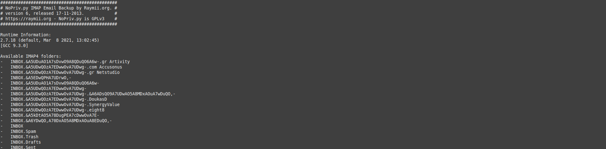
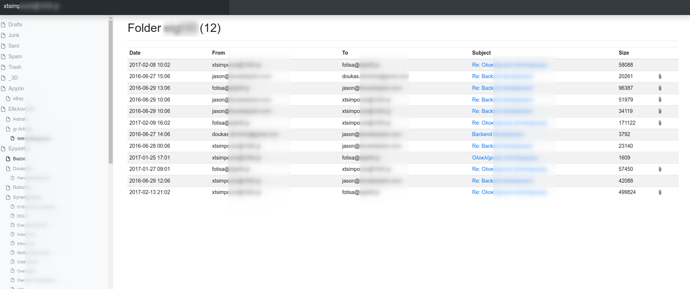

# HTML5 IMAP email backup script

This is a python script to backup any IMAP capable email account to a bowsable HTML archive and a Maildir folder. Not one huge file (mbox), only needing a web browser to view and no proprietary code, so you can make sure I won't steal your password. 

### Screenshots

#### Running the program


#### Index page


#### Folder Overview page 


#### Email itself


### Features

- Python 3
- [Jinja2](https://jinja2docs.readthedocs.io/en/stable/) template for HTML export
- [Bootstrap v4.4.1](https://getbootstrap.com/)
- [Datatables](https://www.datatables.net) to support sorting and searching in all columns within a folder
- [python-slugify](https://pypi.org/project/python-slugify/) so it doesn't matter any more what filenames attachments have. They will be always saved locally in whatever OS as invalid characters are slugified
- Works with any IMAP/IMAPS account
- Supports multiple IMAP folders
- Tries its best to handle many encodings. `chardet` is also comes into play to try and identify missing cases
- Supports text, HTML and multipart email
- Saves attachments
- Backups to HTML files for easy browsing
- Small HTML files can be backed up to external medium more easily, and can be sent over the internet more easily.
- Backs up to Maildir for [easy restoring](http://wiki.colar.net/ruby_script_to_upload_convert_a_maildir_inbox_to_an_imap_server)

### Changelog

New in version 8:
(20-12-2021)
- Python 3 support
- Tries its best to handle many encodings

New in version 7:
(18-12-2021)
- Refactored to extract mails in different folders per account
- Support bootstrap view

New in version 6 (up to fork from [RaymiiOrg/NoPriv](https://github.com/RaymiiOrg/NoPriv)):
(18-11-2013)

- Add support to download all folders without typing them all out. Using "NoPriv_All" as foldername now downloads all available folders.
- Fix quite a few HTML errors
- Converted layout from HTML Kickstart to Twitter Bootstrap
- Add offline mode (only converts the Maildir to HTML, does not try to download new email)

New in version 5:  
(13-11-2013)

- Fix issue #22, NoPriv does not crash on empty IMAP folders anymore
- Fix issue #23, NoPriv now tries a few times when the IMAP connection is reset. This happens with Google Mail sometimes.

New in version 4:

- INI style config, either per user or system wide (thanks to [https://github.com/brejoc](Jochen Breuer))

New in version 3.1:

- Added a sample `muttrc` file to view NoPriv with the Mutt mail client. 

New in version 3:

- Supports incremental backups
- If you stop the backup while running, it will now continue were it left off
- Unread mails stay unread, but are backed up (before they were marked as read)
- Restoring possible because it also creates a Maildir
- Better unicode support
- Attachment page is now also styled

New in version 2:

- Support for multiple IMAP folders
- Index page is generated
- Pages have menu now.
- On running it shows all available IMAP folders.

### Usage

1. Clone the repository:

    git clone https://github.com/xtsimpouris/imap-to-local-html

2. Set up your login details, imap server and ssl:

Clone `imap-to-local-html.sample.yml` to `imap-to-local-html.yml` and edit appropriately:
```yaml
settings:
  domain: imap-domain-name
  username: login-username
  # password is optional, if not provided, it will be requested during execution
  # password: my-secret-password
  folders:
    # list of folders
    # one folder per line
    # or one regular expression per line
    - INBOX
    # to select all
    - --all
  ssl: true
  # default is true
  prettify: true
```

If you want to use SSL to connect to IMAP, enable or disable the options.

**If you want to backup all folders, enter `--all` as a selected `folder`

If you do not know all your folder names, execute python script and checkout the list of folders

If you use gmail and want to backup all your email, use the "[Gmail]/All Mail" folder. It might be named different if you use another locale, for me with a Dutch gmail account it is named "[Gmail]/Alle Berichten".

3. Create a virtual environment and install dependences. It is always better to use a virtual environment
    1. Create one with python 3.x, for example `python3 -m venv env`
    2. Get into it, for example `. env/bin/activate`
    3. Install dependencies from `requirements.txt`, for example `pip install -r requirements.txt`
    4. Execute main program, for example `python imap-to-local-html.py`
    5. Get out from the virtual environment, for example `deactivate`

4. Execute the script:

    `python ./imap-to-local-html.py`

5. Browse the generated backup:

Open the file `index.html` in your browser. There are all your folders and emails.

If you only have a console, it works just fine in Links2 (see above screenshot):
    
    `links2 ./index.html`


### Requirements

Python 3

Tested with: Python 3.8

### Known issues

- No search function.
- Not able to change default sorting (however they come).

## Info on restoring

Script creates a Maildir folder, which houses all your email. You can restore this maildir folder to an IMAP account either by using the script [linked at the top on this page](http://wiki.colar.net/ruby_script_to_upload_convert_a_maildir_inbox_to_an_imap_server), or use a mail client like Mutt or Evolution and transport it to an imap account via there.
